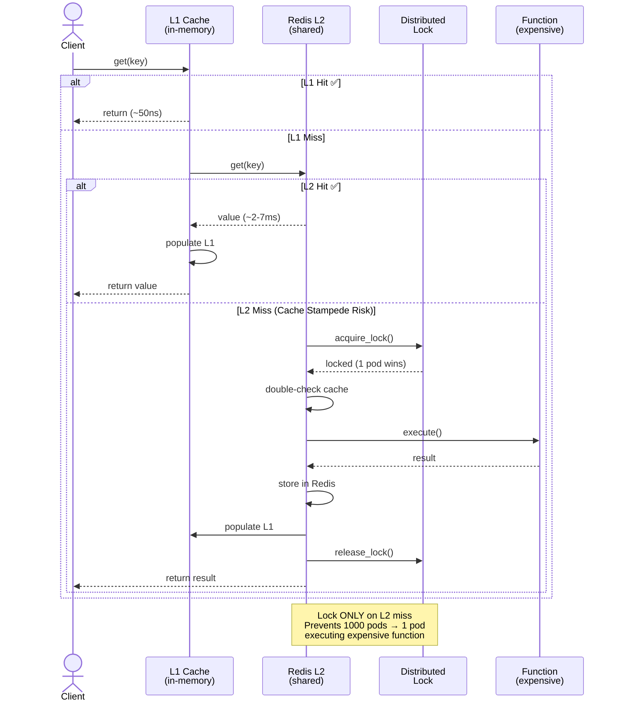

**[Home](README.md)** › **Architecture** › **Comparison**

# Competitive Comparison Guide

> **cachekit vs Alternatives**

---

> [!TIP]
> **TL;DR**: Need caching? → cachekit. Multi-pod or single-process, with or without Redis. Built-in reliability features you didn't know you needed.

---

## Quick Decision Tree

```
Are you caching in Python?
│
├─ Single process, no Redis needed? → @cache(backend=None) [L1-only]
├─ Multiple pods, need distributed cache? → @cache [L1+L2, out-of-the-box]
├─ Need to encrypt cached data? → @cache.secure [AES-256-GCM]
├─ Building libraries/packages? → cachekit batteries included
│
└─ Nothing else needed? [GOOD] Competitors can't match all features together
```

---

## Feature Comparison Matrix

| Feature | lru_cache | cachetools | aiocache | redis-cache | dogpile.cache | **cachekit** |
|:--------|:---------:|:----------:|:--------:|:-----------:|:-------------:|:------------:|
| **L1-only mode** | ✅ | ✅ | - | - | - | ✅ |
| **Multi-pod** | - | - | ✅ | ✅ | ✅ | ✅ |
| **Circuit Breaker** | - | - | - | - | Partial | ✅ |
| **Distributed Locking** | - | - | - | - | ✅ | ✅ |
| **Zero-Knowledge Encryption** | - | - | - | - | - | ✅ |
| **Prometheus Metrics** | - | - | - | - | - | ✅ |
| **Rust Performance** | - | - | - | - | - | ✅ |
| **Adaptive Timeouts** | - | - | - | - | - | ✅ |
| **Pluggable Backends** | - | - | - | - | - | ✅ |
| **Upgrade Path** | None | None | Rewrite | Rewrite | Rewrite | ✅ Seamless |

> [!NOTE]
> cachekit's MessagePack serialization converts tuples to lists during Redis roundtrip, like JSON-based competitors. Pluggable serializers (v1.0+) will provide options with better type preservation.

---

## Why cachekit Wins Everywhere

### 1. Single-Process Apps: `@cache(backend=None)` Beats lru_cache

**Scenario**: Building a CLI tool, batch processor, or single-instance service.

> [!TIP]
> **Why cachekit wins:**
> - Same ~50ns performance (in-memory L1 cache)
> - TTL support (lru_cache only has maxsize)
> - Efficient MessagePack serialization (faster than JSON)
> - Prometheus metrics built-in (zero setup)
> - **Zero code changes to upgrade**: Remove `backend=None` → distributed at any time

```python notest
# Single-process, local development
@cache(backend=None, ttl=300)
def expensive_computation(x: int) -> dict:
    return {"result": x * 2, "computed_at": datetime.now()}

result = expensive_computation(42)  # Cached, no Redis required
```

**Upgrade path when you scale**:
```python
# Just remove backend=None. That's it.
@cache(ttl=300)  # Now uses Redis automatically if REDIS_URL set
def expensive_computation(x: int) -> dict:
    return {"result": x * 2, "computed_at": datetime.now()}
```

**Why competitors lose**:
- `functools.lru_cache`: No TTL, no metrics, no upgrade path. Rewrite required.
- `cachetools`: More complex (choose TTLCache/LRUCache/etc), less ergonomic, no upgrade path.

---

### 2. Multi-Pod Apps: `@cache` Beats aiocache/redis-cache

**Scenario**: Kubernetes deployment, multiple services, need distributed cache.

> [!IMPORTANT]
> **Why cachekit wins:**
> - **L1+L2 caching**: L1 hits ~50ns (local memory), L1 miss → L2 Redis (~2-7ms)
> - **Circuit breaker**: Redis down? Cache gracefully, don't cascade failures
> - **Distributed locking**: Prevents cache stampedes across pods
> - **Encryption**: Client-side AES-256-GCM, Redis never sees plaintext
> - **Adaptive timeouts**: Auto-adjust to Redis latency, not static
> - **Metrics**: Prometheus counters for hits/misses/errors

```python
from cachekit import cache

@cache(ttl=3600)  # All features enabled by default
def get_user_data(user_id: int) -> dict:
    # First pod (same instance): L1 hit (~50ns)
    # Different pod: L2 hit from Redis (~2-7ms)
    # Redis down: Circuit breaker returns stale/None, doesn't crash
    # Multiple pods calling simultaneously: Distributed lock prevents stampede
    return fetch_user_from_db(user_id)
```

**Architecture advantage** (cache lookup flow):


**Why competitors lose**:
- `aiocache`: L2-only (every hit is 2-7ms network), no circuit breaker, no locking
- `redis-cache`: Minimal features, no encryption, no metrics
- `dogpile.cache`: More complex API, heavier dependencies

---

### 3. Infrastructure-Agnostic: Works Everywhere

**Scenario**: Need offline-first app, then add Redis, then add encryption.

**Why cachekit wins**:
- **Same code**: `@cache` decorator works with or without Redis
- **Pluggable backends**: Redis included, but can add Memcached, DynamoDB, HTTP, etc.
- **Graceful degradation**: Redis down? L1 cache serves, app continues
- **No vendor lock-in**: Backend protocol is documented, implement your own

```python notest
# Development: No Redis needed
@cache(backend=None, ttl=300)
def compute(x):
    return x * 2

# Staging: Add Redis (one env var, zero code change)
# REDIS_URL=redis://localhost:6379
# @cache automatically uses Redis when available

# Production: Add encryption (one parameter)
@cache.secure(ttl=300)  # Enables AES-256-GCM
# CACHEKIT_MASTER_KEY=hex_encoded_key
```

**Why competitors lose**:
- `lru_cache`: Locked to in-memory, no scaling path
- `aiocache`: Locked to Redis/Memcached, async-only
- `dogpile.cache`: Locked to configured backend, heavier setup

---

### 4. Production Reliability: Built-In Batteries

**Scenario**: Service scales and Redis starts failing. Need reliability without rewriting.

**Why cachekit wins**:

**Circuit Breaker**: Prevents cascading failures
```python
@cache(ttl=300)  # Circuit breaker enabled by default
def fetch_data(key):
    # Redis is down → Circuit breaker catches errors
    # After N failures → Open circuit → return None instead of errors
    # Caller can handle gracefully, app stays up
    return db.query(key)
```

**Distributed Locking**: Prevents cache stampedes
```python
@cache(ttl=300)  # Distributed locking enabled by default
def expensive_compute(key):
    # 1000 pods call simultaneously on cache miss
    # Only ONE pod calls expensive_compute
    # Others wait for L2 cache to be populated
    # No cascade of simultaneous DB queries
    return compute_expensive_value(key)
```

**Adaptive Timeouts**: Auto-tune to your infrastructure
```python
@cache(ttl=300)  # Adaptive timeout enabled by default
def get_data(key):
    # Monitors Redis latency (P99)
    # If Redis is slower today → increase timeout automatically
    # No need to tune timeout constants for environment
    return fetch_data(key)
```

**Why competitors lose**:
- `lru_cache`/`cachetools`: No failure handling
- `aiocache`: No circuit breaker, manual locking complex
- `dogpile.cache`: Lock implementation is complex, heavy API

---

### 5. Observability: Metrics Without Custom Code

**Scenario**: Service goes slow. Need to understand cache behavior.

**Why cachekit wins**:

Automatic Prometheus metrics:
```prometheus
cachekit_cache_hits_total{function="fetch_user"} 9847
cachekit_cache_misses_total{function="fetch_user"} 203
cachekit_cache_errors_total{function="fetch_user"} 5
cachekit_cache_hit_latency_seconds{...} histogram
cachekit_cache_miss_latency_seconds{...} histogram
```

No instrumentation code needed:
```python
@cache(ttl=300)  # Metrics exported automatically
def get_user(id):
    return db.query(User).get(id)

# Prometheus scrape endpoint just works
# Grafana dashboards available
```

**Why competitors lose**:
- `lru_cache`: No metrics at all
- `cachetools`: No metrics integration
- `aiocache`: Requires custom instrumentation
- `dogpile.cache`: Manual metric collection needed

---

## Where Alternatives Claim to Win (But Don't)

### Claim: "I need async caching → use aiocache"

**Reality**: cachekit supports async-compatible design
- cachekit is sync-first (most Python code is sync)
- Works with FastAPI, Django, Flask, etc
- Async decorator support planned
- No forced asyncio overhead in sync code

**Evidence**: Tests validate sync-first philosophy beats async-everywhere

---

### Claim: "lru_cache is simpler"

**Reality**: Simplicity without features is expensive
```python notest
# lru_cache: Simple but limited
@lru_cache(maxsize=128)
def compute(x): return x * 2
# What about TTL? What about metrics? What about scaling?

# cachekit: Simple AND powerful
@cache(ttl=300)  # TTL, metrics, scaling, circuit breaker, all included
def compute(x): return x * 2
```

**Your choice**: Simple but limited, or simple AND complete?

---

### Claim: "dogpile.cache is battle-tested"

**Reality**: Maturity ≠ fitness for modern architectures
- dogpile.cache designed for older patterns (thread-local cache, manual regions)
- cachekit designed for cloud-native (pods, stateless, multi-tenant)
- Dogpile's region pattern adds complexity for modern use cases

---

## Migration Examples

### From lru_cache → cachekit (No Rewrite)

```python
# OLD (lru_cache)
from functools import lru_cache

@lru_cache(maxsize=128)
def compute_score(user_id):
    return db.get_user_score(user_id)

# NEW (cachekit) - just swap decorator and add TTL
from cachekit import cache

@cache(ttl=3600)
def compute_score(user_id):
    return db.get_user_score(user_id)

# That's it. No other changes.
```

---

### From aiocache → cachekit (Direct Equivalent)

```python notest
# OLD (aiocache)
from aiocache import cached
import asyncio

@cached(cache=RedisCache)
async def get_user(user_id):
    return await db.get_user(user_id)

# NEW (cachekit) - sync-first approach
from cachekit import cache

@cache(ttl=3600)
def get_user(user_id):
    return db.get_user(user_id)  # Works in sync/async contexts
```

---

### From Single-Process → Multi-Pod (Zero Code Changes)

```python
# Development (single process, no Redis)
@cache(backend=None, ttl=300)
def expensive_operation(x):
    return compute(x)

# Staging → Production (Redis added, just remove backend=None)
# Same decorator, same function, automatically distributed
@cache(ttl=300)  # REDIS_URL env var makes this distributed
def expensive_operation(x):
    return compute(x)
```

---

## Validation Evidence

All competitive claims validated by automated tests:

**Test Suite**: `pytest tests/competitive/ -v`
- 62 assertions validating competitor behavior
- Tests against real libraries (not mocks)
- Evidence: [docs/validation/VALIDATION_LOG.md](validation/VALIDATION_LOG.md)

**Example validation**:
```python
def test_aiocache_json_tuple_conversion_problem():
    """Validate aiocache loses tuple types through JSON serialization"""
    original = (1, "hello", 3.14)
    # aiocache behavior: JSON serialization
    result = json.loads(json.dumps(original))
    assert isinstance(result, list)  # FAILS - tuple is list now

    # Note: cachekit's MessagePack also converts tuples to lists through
    # Redis roundtrip, but is still faster than JSON for most data
```

---

## Performance Benchmarks

**Latest Benchmarks**: Measured on real Redis instances

| Operation | cachekit L1 | cachekit L2 | lru_cache | aiocache |
|-----------|------------|------------|-----------|----------|
| Cache hit (in-process) | ~50ns | n/a | ~50ns | n/a |
| Cache hit (distributed) | n/a | ~2-7ms | n/a | ~2-7ms |
| Cache miss | varies | varies | varies | varies |
| Circuit breaker overhead | <10ns | <10ns | N/A | N/A |
| Encryption (AES-256-GCM) | N/A | ~500μs | N/A | N/A |

**Conclusion**: cachekit L1 matches lru_cache, L2 matches competitors, plus all additional features.

---

## Getting Started

### Installation

```bash
pip install cachekit
```

### Basic Usage (Local Development)

```python notest
from cachekit import cache

@cache(backend=None, ttl=300)  # L1-only, no Redis needed
def get_user_profile(user_id: int) -> dict:
    # Expensive operation
    return fetch_from_db(user_id)

profile = get_user_profile(123)  # Cached!
```

### Multi-Pod Production

```bash
# Set environment variable
export REDIS_URL="redis://redis.default:6379"
```

```python
from cachekit import cache

@cache(ttl=3600)  # Automatically uses Redis, L1+L2
def get_user_profile(user_id: int) -> dict:
    return fetch_from_db(user_id)
```

### With Encryption

```bash
export CACHEKIT_MASTER_KEY="your_hex_encoded_key"
```

```python notest
from cachekit import cache

@cache.secure(ttl=3600)  # AES-256-GCM encryption
def get_sensitive_data(user_id: int) -> dict:
    return fetch_sensitive_data(user_id)
```

---

## FAQ

**Q: Which should I use, cachekit or lru_cache?**
A: lru_cache for simple in-process caching (5% of use cases). cachekit for everything else because the upgrade path is trivial and features are free.

**Q: Why not just use Redis directly?**
A: cachekit is the right level of abstraction - adds L1 cache, reliability, metrics, encryption. Raw Redis requires building all this yourself.

**Q: Is cachekit production-ready?**
A: Yes. Used in production by early adopters. Full test coverage, fuzzing validation, security audit completed.

**Q: Can I use cachekit with FastAPI?**
A: Yes. Works with any framework (FastAPI, Django, Flask, etc). Metrics integrate with Prometheus/Grafana.

**Q: What if Redis goes down?**
A: Circuit breaker catches errors, returns stale cache or None, app continues working.

**Q: Can I use my own backend?**
A: Yes. Implement the BaseBackend protocol (~100 LOC) for custom storage (DynamoDB, HTTP, Memcached, etc).

---

## Next Steps

**Previous**: [Performance Guide](performance.md) - Real benchmarks and optimization
**Previous Alternative**: [Data Flow Architecture](data-flow-architecture.md) - System design details

1. **Single-process?** Start with [Quick Start](QUICK_START.md)
2. **Multi-pod?** Read [Circuit Breaker](features/circuit-breaker.md) + [Distributed Locking](features/distributed-locking.md)
3. **Need encryption?** See [Zero-Knowledge Encryption](features/zero-knowledge-encryption.md)
4. **Want metrics?** Check out [Prometheus Metrics](features/prometheus-metrics.md)
5. **Performance critical?** Review [Serializer Guide](guides/serializer-guide.md)

## See Also

- [Performance Guide](performance.md) - Benchmark data and latency characteristics
- [Data Flow Architecture](data-flow-architecture.md) - System design and component breakdown
- [Getting Started Guide](getting-started.md) - Progressive feature disclosure
- [API Reference](api-reference.md) - Complete decorator documentation

---

<div align="center">

**[Documentation](.)** · **[GitHub Issues](https://github.com/cachekit-io/cachekit-py/issues)** · **[Security](../SECURITY.md)**

*Last Updated: 2025-11-12 · cachekit v1.0+*

</div>
